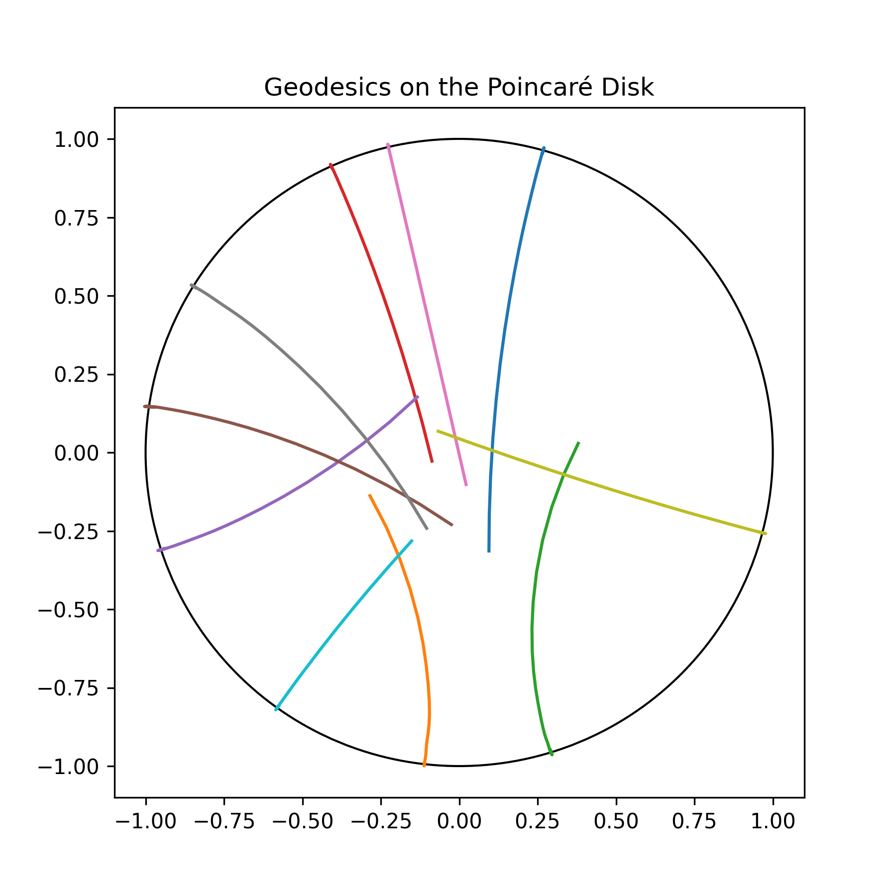
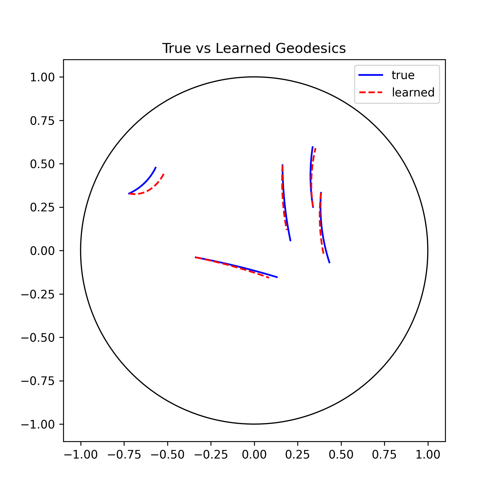

# Neural ODEs for Learning Hyperbolic Geodesic Flow

## 1. Overview
How well can a neural network learn the continuous dynamics of a flow directly from trajectory data, without explicit knowledge of the governing differential equations?

I built a Neural ODE that learns the geodesic flow on the Poincaré disk from simulated trajectory data. I also compared the errors of the learned trajectories with the true trajectories, showing that the model generates trajectories closely matching the analytic trajectories.

## 2. Results
### Ground Truth Trajectory

### Learned Trajectory

### Key Results
- Neural ODE successfully learned the geodesic vector field.
- Predicted trajectories closely match the analytic trajectories.
- Training loss converged below 0.0015.

## 3. Motivation
The objective of this project is to learn the continuous dynamics of geodesic flow directly from trajectory data. Unlike a standard neural network that predicts only the next state, a Neural ODE learns the underlying vector field, allowing the learned dynamics to be integrated from arbitrary initial conditions to generate complete trajectories.

## 4. Mathematical Background
- Poincaré disk is the surface with constant curvature -1 everywhere, a fundamental object in differential geometry and dynamical systems.
- The geodesic flow describes how a point and its tangent direction evolve as they move along geodesics on the surface. A geodesic is the natural notion of a "straightest possible path" on a curved surface.
- The state space is the collection of points $(x,y,\theta)$ where $x^2+y^2 < 1$ and $\theta \in (0, 2 \pi]$ (unit tangent bundle of the Poincaré disk).

## 5. Methodology
- Data: 
    - Sample initial states on the unit tangent bundle.
    - Integrate the analytic geodesic equations with solve_ivp.
    - Use the resulting trajectories as supervision.
- Training:
    - Neural ODE with a 3→64→64→3 architecture.
    - Tanh activations.
    - Adam optimizer
    - MSE loss
- Evaluation:
    - Compare predicted and analytic trajectories by plotting trajectory overlays.
    - Report final training loss.

## 6. Repository Structure
```text
README.md
DESIGN.md
Neural_ODE_Geodesic_Flow.ipynb
requirements.txt
figures/
models/
```

## 7. How to Run
1. Install the required packages:
    ```bash
    pip install -r requirements.txt
    ```
2. Open and run Neural_ODE_Geodesic_Flow.ipynb.

## 8. Future Work
- Magnetic flows
- Higher-dimensional manifolds
- Hamiltonian Neural Networks

## 9. Skills Demonstrated
- PyTorch
- Neural ODEs
- torchdiffeq
- Scientific Machine Learning
- Numerical ODE Solvers
- Differential Geometry
- NumPy
- Matplotlib