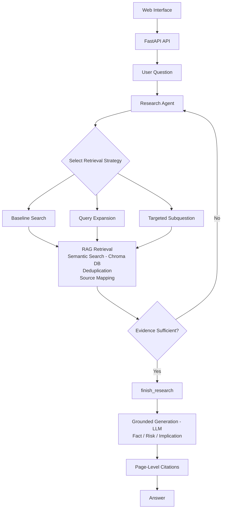

# Agentic Financial Research Assistant

An agentic financial research system that combines **citation-grounded Retrieval-Augmented Generation (RAG)** with a **tool-using research agent** to analyze NVIDIA's 10-K.

The goal is to build a financial research workflow that not only grounds every answer in NVIDIA's 10-K and **nothing else**, but also **traceable, controllable, and evaluable**.

## 1. Project Overview

The system retrieves evidence from NVIDIA's annual filing, dynamically selects research strategies based on the question, evaluates whether the evidence is sufficient, and generates structured and source-grounded financial analysis with page-level citations using an LLM. 

The research pipeline is exposed through a **FastAPI backend** and a lightweight **web interface** for interactive use.

The project focuses on two complementary components:

- **Citation-Grounded RAG:** A retrieval pipeline that retrieves, deduplicates, and organizes relevant evidence from NVIDIA's 10-K before generating a citation-grounded answer using an LLM.    
- **Agentic Research:** A tool-using research agent that dynamically selects retrieval tools (for example, direct search for factual questions or decomposition of complex questions into targeted research tasks), performs additional searches when necessary, and explicitly determines when to conclude the research based on whether sufficient evidence has been collected to answer the question.

The two components serve different purposes: **RAG provides the evidence foundation, while the agent controls the research process.**

The overall workflow is:
>User Question → Agentic Research → Retrieval through the RAG system → Evidence Evaluation → Research Completion → Grounded Answer using an LLM
 
## 2. Key Features

- **Adaptive Research Strategy:** Selects among multiple retrieval strategies based on the structure of the question, including direct retrieval for focused factual questions, query expansion for broad questions, and targeted subquestions for multi-part research tasks.

- **Retrieval Evaluation:** Compares baseline and query-expanded search using precision and recall.

- **Explicit Research Completion:** Uses a dedicated `finish_research` tool as an explicit control boundary between evidence gathering and grounded generation. The agent's LLM evaluates the accumulated evidence and decides when the research phase is complete.

- **Page-Level Citations:** Converts internal source identifiers into human-readable citations that link substantive claims to the relevant pages of NVIDIA's 10-K.

- **API and Web Interface:** Exposes the research pipeline through a FastAPI backend and a web interface for interactive financial research.

## 3. System Architecture



## 4. RAG Pipeline

### 4.1. Document Processing
The NVIDIA 10-K is loaded and divided into overlapping text chunks using a recursive text splitter.
Each chunk retains document metadata, including its source and page information, allowing retrieved evidence to be traced back to the original filing.

### 4.2. Embedding and Vector Search
Document chunks are embedded using OpenAI's `text-embedding-3-small` embedding model and stored in Chroma. At query time, semantic similarity search identifies the top-`k` passages relevant to the research question. The value of `k` can be configured based on the retrieval task.

### 4.3. Query Expansion
For questions where a single search query may not provide sufficient retrieval coverage, the system can ask an LLM to generate multiple alternative formulations of the original research question. These formulations are searched independently, increasing the chance of retrieving relevant evidence expressed using terminology different from the original question.

### 4.4. Retrieval and Deduplication

Each expanded query retrieves multiple candidate chunks.
Because different queries can retrieve the same passage, the system deduplicates chunks before constructing the final research context. The resulting evidence is organized while preserving the source document and page metadata needed for citation.

### 4.5. Grounded Generation
The retrieved passages are passed to the LLM with explicit instructions to:
- use only the supplied sources from the underlying file;
- distinguish reported facts from analytical inference;
- identify business and financial risks;
- explain implications;
- cite substantive claims.

This ensures that the generated analysis remains grounded in the retrieved evidence rather than relying on unsupported external knowledge.

### 4.6. Citation Generation
The system initially assigns internal source identifiers to retrieved evidence, such as:
`[SOURCE_1]`
After generation, these identifiers are mapped back to the underlying document and page:
`[NVIDIA 2026 10-K, Page 17]`
This creates an auditable connection between generated analysis and the source evidence supporting the claim.

## 5. Agentic Research Workflow

### 5.1. Adaptive Tool Selection

The research agent has access to three retrieval tools, each suited to a different type of question:

- **`search_with_baseline`** — direct vector retrieval for focused factual questions.
- **`search_with_query_expansion`** — generates multiple formulations of a question to improve retrieval coverage for broad or ambiguous questions.
- **`search_targeted_subquestion`** — retrieves evidence for specific components of a multi-part research question.

Rather than following a fixed retrieval sequence, the agent selects the appropriate strategy based on the structure of the user's question.

### 5.2. Iterative Research and Explicit Completion

After each retrieval step, the agent's LLM evaluates the evidence accumulated during the research process and decides whether it is sufficient to answer the question. If not, it can select another retrieval strategy and begin another research round. The system limits research to a maximum of three rounds to prevent unnecessary retrieval and uncontrolled tool use.

Once the agent's LLM determines that sufficient evidence has been collected, or the maximum number of research rounds has been reached, the agent calls the dedicated `finish_research` tool to terminate the research phase and pass the accumulated evidence to grounded generation.

For example, for a straightforward factual question, a single retrieval may be sufficient:

```text
Baseline Search
      ↓
Evidence Evaluation
      ↓
Sufficient
      ↓
finish_research 
```

For a broader question, the agent may perform multiple research rounds:
```text
Query Expansion
      ↓
Evidence Evaluation
      ↓
Insufficient
      ↓
Targeted Research
      ↓
Evidence Evaluation
      ↓
     ...
      ↓
Sufficient 
(or the maximum number of research rounds has been reached)
      ↓
finish_research
```

### 5.3. Research Trace

The system records the sequence of retrieval tools selected by the agent and the number of research rounds performed.

For example:

```text
Round 1
Strategy: search_with_query_expansion
Reason: Broad question; multiple risk categories may be relevant.

Round 2
Strategy: search_targeted_subquestion
Reason: Additional evidence needed for specific risk categories.

Round 3
Strategy: search_targeted_subquestion
Reason: Additional evidence needed for specific risk categories, or the maximum number of rounds of research has been reached

Completion
Tool: finish_research
```

## 6. Evaluation

The system is evaluated at three levels: **retrieval quality, agent behavior, and final answer grounding**.

### 6.1. Retrieval Evaluation

The retrieval pipeline was evaluated using a fixed set of 10 manually constructed financial research questions with manually defined expected source pages.

Two retrieval configurations were compared:

1. **Baseline retrieval** — direct semantic search using the original question.

2. **Query-expanded retrieval** — LLM-generated search queries followed by multi-query retrieval and deduplication.

#### Results

| System | Retrieval Recall | Retrieval Precision |
|---|---:|---:|
| Baseline | 80.0% | 52.0% |
| Query Expansion | **90.0%** | 42.9% |

On this evaluation set, query expansion increased retrieval recall from **80.0% to 90.0%**, while precision decreased from **52.0% to 42.9%**.

This illustrates a retrieval trade-off: expanding the search improves coverage, but can also introduce less relevant evidence.

### 6.2. Agent Behavior Evaluation

The research agent was evaluated using representative test cases covering different research patterns:

- **Simple factual questions:** The agent should select baseline retrieval and stop when sufficient evidence is available.

- **Broad questions:** The agent should use query expansion and perform additional research when necessary.

- **Multi-part questions:** The agent should use targeted subquestions to address distinct research components.

The evaluation records the agent's selected tools, number of research rounds, final answer, and retrieved sources, allowing its research behavior to be inspected and manually verified.

### 6.3. Answer Grounding and Citation Evaluation

To evaluate the reliability of final outputs, three representative agent-generated answers were manually reviewed at the claim level.

Each substantive claim was evaluated for:

- **Citation correctness:** whether the cited source page supports the associated claim.

- **Citation completeness:** whether substantive claims derived from the source document are supported by citations.

- **Groundedness:** whether the generated answer is supported by the retrieved evidence, including reasonable analytical implications.

The evaluation produced the following results:

| Metric | Result |
|---|---:|
| Citation correctness | **17 / 18 claims passed (94.4%)** |
| Citation completeness | **16 / 18 claims passed (88.9%)** |
| Groundedness* | **3 / 3 answers passed (100%)** |

\* Groundedness evaluates whether claims are supported by the retrieved evidence. A page-level citation error does not necessarily make an answer ungrounded if the claim is supported by other retrieved evidence.

The claim-level evaluation annotations are stored in
`data/grounding_evaluation.json`, and the evaluation metrics can be reproduced using
`tests/evaluate_grounding.py`:

```bash
PYTHONPATH=. .venv/bin/python tests/evaluate_grounding.py
```

The evaluation is intentionally small and manually annotated. These results demonstrate the grounding behavior of the representative cases but should not be interpreted as a comprehensive benchmark of answer faithfulness or citation reliability.

## 7. Project Structure

```text
Project_4_ai_financial_research_assistant/
│
├── src/
│   ├── agent.py
│   ├── config.py
│   ├── generation.py
│   ├── pipeline.py
│   └── retrieval.py
│
├── tests/
│   ├── evaluate_agent.py
│   └── test_agent_cases.py
│
├── scripts/
│   ├── app.py
│   ├── chunk_documents.py
│   ├── create_vector_db.py
│   ├── evaluate_baseline.py
│   ├── evaluate_rag.py
│   ├── load_10k.py
│   ├── read_pdf.py
│   ├── run_evaluation_questions.py
│   └── test_research.py
│
├── data/
│   ├── evaluation_questions.json
│   └── nvidia_10k.pdf
│
├── frontend/
│   ├── index.html
│   ├── script.js
│   └── style.css
│
├── .env.example
├── .gitignore
├── README.md
└── requirements.txt
```

### Core Modules

- **`src/config.py`** — Centralizes configuration for the LLM, embedding model, and vector database.

- **`src/agent.py`** — Implements the research agent, including adaptive tool selection, iterative research, evidence sufficiency checks, and explicit research completion.

- **`src/retrieval.py`** — Implements semantic retrieval, query expansion, targeted retrieval, and evidence deduplication.

- **`src/generation.py`** — Builds the research context, generates grounded answers, and maps internal source identifiers to human-readable page citations.

- **`src/pipeline.py`** — Connects the retrieval and generation components into the underlying RAG research pipeline.

### Evaluation and Application

- **`tests/evaluate_agent.py`** — Runs representative financial research questions and records the agent's tool-selection trace, research rounds, final answer, and retrieved sources.

- **`tests/test_agent_cases.py`** — Tests agent behavior across different question types.

- **`data/evaluation_questions.json`** — Fixed set of questions used for retrieval evaluation.

- **`scripts/`** — Contains supporting scripts for document processing, vector database construction, retrieval evaluation, and running evaluation questions.

- **`scripts/app.py`** — Provides the FastAPI application that exposes the research pipeline through an API.

## 8. Running the Project

### 8.1. Installation
Clone the repository and navigate to the project directory:

```bash
git clone https://github.com/jcswang54/Machine_Learning.git
cd Machine_Learning/Project_4_ai_financial_research_assistant
```
Then create a virtual environment and install the dependencies:
```bash
python3 -m venv .venv
source .venv/bin/activate

pip install -r requirements.txt
```
### 8.2. Configure the API Key

Create a `.env` file in the project root based on `.env.example`:
```bash
OPENAI_API_KEY=your_api_key_here
```
### 8.3. Build the Vector Database

The NVIDIA 10-K must first be processed, chunked, embedded, and stored in the Chroma vector database.

From the project root:
```bash
PYTHONPATH=. .venv/bin/python scripts/load_10k.py
PYTHONPATH=. .venv/bin/python scripts/create_vector_db.py
```

### 8.4. Run the Evaluation

The retrieval evaluation uses the fixed evaluation questions in `data/evaluation_questions.json`.

The agent evaluation uses representative test cases defined in `tests/test_agent_cases.py`.

To run the retrieval evaluation:
```bash
PYTHONPATH=. .venv/bin/python scripts/evaluate_baseline.py
```

To run the agent evaluation:
```bash
PYTHONPATH=. .venv/bin/python tests/evaluate_agent.py
```

### 8.5. Run the FastAPI Backend and the Web Interface

Start the FastAPI application with Uvicorn:
```bash
PYTHONPATH=. .venv/bin/uvicorn scripts.app:app --reload
```

In a separate terminal, from the project root, start the frontend server:
```bash
.venv/bin/python -m http.server 8080 --directory frontend
```
Then open:

`http://127.0.0.1:8080`

The web interface sends research questions to the FastAPI backend and displays the generated answer and source citations.

### 8.6. Test the Research Pipeline

The research pipeline can be tested directly from the command line:
```bash
PYTHONPATH=. .venv/bin/python scripts/test_research.py
```

## 9. Example Questions and Results

The examples below illustrate how the research agent adapts its retrieval strategy to the structure of the question.

### Example 1: Direct Factual Question

**Question:**
> What was NVIDIA's revenue in fiscal 2026?

**Research Trace:**

```text
search_with_baseline
        ↓
finish_research
```

Answer:
> NVIDIA reported fiscal 2026 revenue of $215.938 billion. [NVIDIA 2026 10-K, Page 51]

For a direct factual question, the agent uses baseline retrieval and concludes the research once sufficient evidence has been collected.

### Example 2: Broad Research Question

**Question:**
> What are the major risks to NVIDIA's future growth?

**Research Trace:**

```text 
search_with_query_expansion
      ↓
search_targeted_subquestion
      ↓
search_targeted_subquestion
      ↓
finish_research
```

Answer:
> The system identifies several major risk categories, including:
> AI infrastructure constraints; supply and demand mismatch; export controls and geopolitical restrictions; competition; software monetization risk; cloud-capacity commitments; and regulatory scrutiny.

Each substantive claim is grounded in evidence from NVIDIA's 10-K and linked to the relevant page.

This example demonstrates the agent's ability to perform iterative research rather than relying on a single retrieval step for a broad question.

### Example 3: Unsupported Forecast

**Question:**
> What will NVIDIA's stock price be in 2030?

**Answer:**

> The system does not generate a numerical prediction because the NVIDIA 10-K does not contain sufficient evidence to support a 2030 stock-price forecast.

This demonstrates the system's grounding constraint: when the available evidence cannot support an answer, the system avoids presenting an unsupported conclusion as fact.

## 10. Limitations and Future Improvements

### Limitations

- **Small evaluation set:** Retrieval performance is measured on 10 manually constructed questions, so the reported metrics should not be interpreted as a general benchmark.

- **Page-level ground truth:** Retrieval evaluation uses expected source pages as the relevance criterion. A retrieved chunk can contain useful information even when its page is not included in the manually defined ground truth.

- **Retrieval quality trade-offs:** Query expansion improved recall but reduced precision in the current evaluation, showing that additional queries can increase retrieval coverage while also introducing irrelevant results.

- **Limited agent evaluation:** Agent behavior is currently evaluated using representative question types, research traces, and research-round limits rather than a comprehensive quantitative benchmark of tool selection and research efficiency.

- **Single-company document scope:** The current knowledge base is limited to NVIDIA's 2026 10-K and does not yet support cross-company or multi-year financial research.

- **LLM dependence:** Query expansion, research strategy selection, evidence evaluation, and answer generation depend on an external LLM, so results can vary with model behavior and API availability.

### Future Improvements

- Expand the knowledge base to support multiple companies and multiple years of financial filings.

- Improve retrieval and reranking to increase answer quality and citation reliability.

- Add quantitative evaluation of agent performance, including tool-selection accuracy, research efficiency, unnecessary retrieval, and research completion behavior.

- Extend the frontend to support direct inspection of cited source passages.

## 11. Technology Stack

### AI / Machine Learning

- **Python**
- **OpenAI GPT models:** Query expansion, research strategy selection, evidence evaluation, and grounded answer generation.
- **OpenAI `text-embedding-3-small`:** Document embeddings for semantic retrieval.
- **Retrieval-Augmented Generation (RAG)**
- **Semantic vector search**
- **Chroma:** Vector database for document retrieval.
- **LangChain:** Used for LLM, embedding, vector-store, document-processing, and agent-tool integrations.

### Agentic Research

- **Tool-using research agent:** Adaptive selection among baseline retrieval, query expansion, and targeted subquestion search.
- **Iterative research workflow:** Evidence sufficiency evaluation and explicit `finish_research` completion.

### Evaluation

- **Retrieval evaluation:** Precision and recall against manually defined source-page ground truth.
- **Agent behavior evaluation:** Representative question cases, tool-selection traces, and research-round analysis.

### Backend

- **FastAPI:** API layer for the research pipeline.

### Development

- **Git / GitHub**
- **Python virtual environment**
- **Environment-based API key configuration**